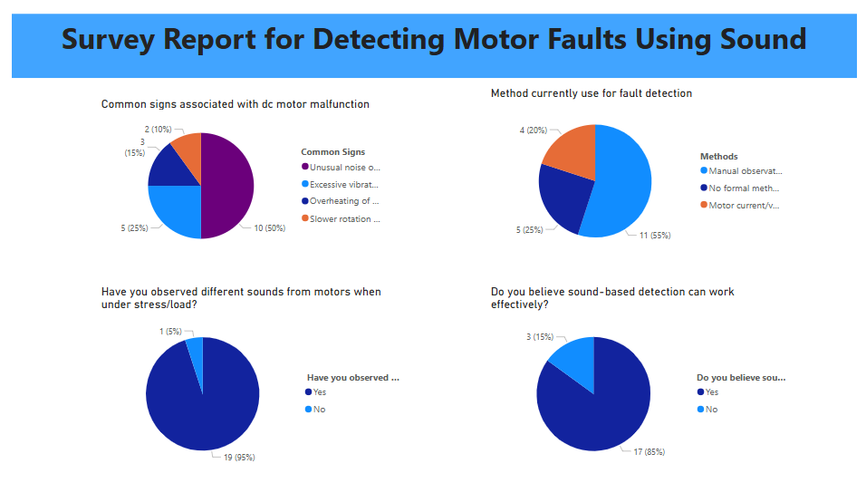

# AI-Based DC Motor Fault Detection Using Sound

This repository presents our embedded systems project focused on **AI-based DC motor fault detection using sound**. As part of the project, we conducted a survey to understand current practices and perceptions related to motor fault detection, especially using sound.

## 📊 Survey Overview

We created a survey using Google Forms and collected responses to understand:

- Common signs associated with DC motor malfunction
- Current methods used for motor fault detection
- Observations of sound variation under motor stress/load
- Beliefs about the effectiveness of sound-based fault detection

### 📈 Power BI Dashboard

The survey results were visualized using **Power BI** to gain clear insights from the data. 

The dashboard includes four pie charts based on the survey questions:

#### 1. Common Signs Associated with DC Motor Malfunction
- **50%** reported *Unusual noise or sound*
- **25%** reported *Excessive vibrations*
- **15%** reported *Overheating*
- **10%** reported *Slower rotation*

#### 2. Method Currently Used for Fault Detection
- **55%** use *Manual observation*
- **25%** use *No formal method*
- **20%** use *Motor current/vibration data*

#### 3. Observed Different Sounds Under Stress/Load
- **95%** observed changes in motor sound
- **5%** did not observe any change

#### 4. Belief in Effectiveness of Sound-Based Detection
- **85%** believe it can work
- **15%** are skeptical

## 🎯 Project Goal

Our goal is to develop a **machine learning model** capable of predicting motor faults based on audio signals. This survey helped validate the feasibility and gather insights into the industry practices and user expectations.

## 📁 Repository Contents

- `survey-dashboard.png`: Screenshot of Power BI dashboard summarizing the survey results.
- `README.md`: Project overview and context.
- `Fault Detection.pbix`: Power BI Dashboard
- `Fault Detection.xlsx`: Data collected from survey
- Future updates will include:
  - Collected audio samples
  - Feature extraction scripts
  - Trained ML models
  - Fault prediction demo

## 🚀 Tech Stack

- Google Forms (Survey)
- Power BI (Data Visualization)
- Python (For future AI model development)
- Arduino (Hardware interface)

## 🙌 Contributors

- Sobia Karim, Layba Huda, KhushBakht Anwar
  *Embedded Systems Project - AI DC Motor Fault Detection*

